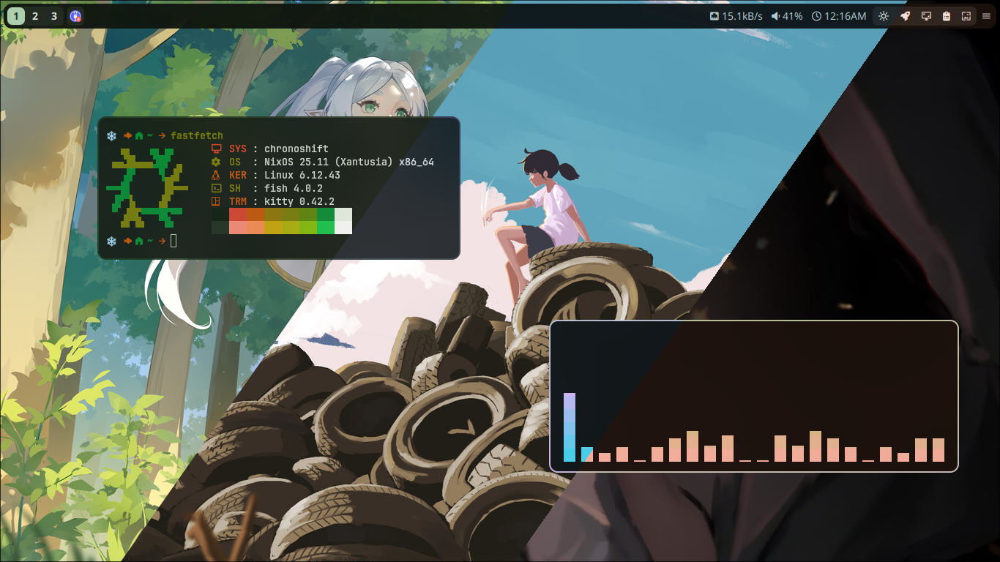

# Material

[](https://pkg.go.dev/github.com/Nadim147c/rong)
[](https://github.com/Nadim147c/rong)
[](./LICENSE)
[](https://github.com/Nadim147c/rong/tags)

> [!IMPORTANT]
> 🔥 Found this useful? A quick star goes a long way.

**Rong** is a CLI that extracts a **Material You** color palette from an image or
video, and applies it across your system using configurable template mappings.

### 🎨 Features

- Extracts color palettes from **images** or **videos**
- Generates color output using customizable **templates**
- Automatically writes output to multiple **target files**
- Easily theme apps like **WezTerm**, **Eww**, **Kitty**, **Spicetify**, **Waybar**,
  and **Discord mods**



**Example:**

```sh
rong image ~/Pictures/wallpaper.jpg
```

Check out the [documentation](https://nadim147c.github.io/rong).

## Contribution Guide

You're welcome to contribute in the following ways:

1. **Code (Go)** – Add features, fix bugs, or improve code. Stick to existing patterns and open a clear PR.

2. **Templates** – Add custom templates for any app using Go's `template` engine. Keep them clean and reusable.

3. **Docs** – Write or improve docs (VitePress Markdown). New pages, typo fixes, or better explanations all help.

## License and Credit

Rong is licensed under [GNU GPL-3.0](./LICENSE). This cli uses [material](https://github.com/Nadim147c/material)
for generating colors.

### Thanks to

- [Matugen](https://github.com/InioX/matugen-themes/): For some of the templates.
- [Material Color Utilities](https://github.com/material-foundation/material-color-utilities): For the material color algorithm.
