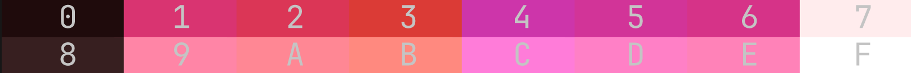
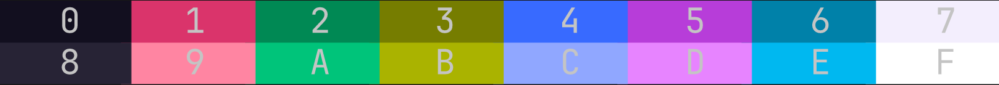
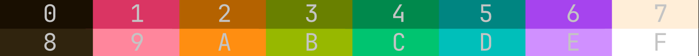
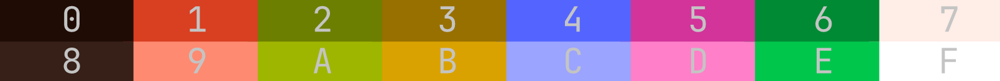

# Base16

In **Rong**, _Base16_ refers to **terminal color schemes**, not the
[Base16 Design framework](https://github.com/chriskempson/base16). Rong generates 16
colors compatible by terminals.

## Why?

[Base16 framework](https://github.com/chriskempson/base16) is a styling guide for a
base of 16 colors used in UIs. However, we already have a UI color scheme ([`Material
You`](https://m3.material.io/)). **_Why do we need Base16?_** The Material You color
scheme has three main colors (`primary`, `secondary`, and `tertiary`) with different
variants. These are enough for most UI designs but not for terminals. Terminals
require 16 colors, which cannot be derived directly from the Material You scheme.
Thus, Rong uses [clever tricks](#methods) to generate six additional colors and uses
Material You's `on_background` and `background` as white and black to get eight
unique colors. We then adjust their shades to produce the full set of 16 colors for
the terminal.

## Methods

Rong provides two different ways to generate `Base16` colors:

1. **Dynamic**:
   In dynamic mode (`--base16.method=dynamic`), `Base16` colors are generated from
   the source image or video. Rong also ensures maximum variation between colors,
   then adjusts saturation and lightness to correct any unwanted tones. Depending on
   the source, you may get a wide variety of colors or different shades of the same
   color.

2. **Static**:
   In static mode (`--base16.method=static`), `Base16` colors are created from a
   predefined set. These predefined colors are blended with the `primary` color from
   the Material You palette, and Rong then adjusts saturation and lightness to refine
   the result. You can control the blending ratio to fine-tune the outcome.

Use **dynamic mode** when you want colors that truly match your wallpaper. Use
**static mode** when you prefer consistent, stable colors—where green looks similar
to green and red looks like red.

| Dynamic                                    | Static                                    |
| ------------------------------------------ | ----------------------------------------- |
|     |      |
|  |  |

## ANSI terminal colors

Terminal (ANSI) color are arranged like this:

| Index | Name           | Description               |
| ----: | -------------- | ------------------------- |
|     0 | Black          | normal black              |
|     1 | Red            | normal red                |
|     2 | Green          | normal green              |
|     3 | Yellow         | normal yellow             |
|     4 | Blue           | normal blue               |
|     5 | Magenta        | normal magenta            |
|     6 | Cyan           | normal cyan               |
|     7 | White          | normal white              |
|     8 | Bright Black   | bright black (often gray) |
|     9 | Bright Red     | bright red                |
|     A | Bright Green   | bright green              |
|     B | Bright Yellow  | bright yellow             |
|     C | Bright Blue    | bright blue               |
|     D | Bright Magenta | bright magenta            |
|     E | Bright Cyan    | bright cyan               |
|     F | Bright White   | bright white              |

## Examples

- If an app prints ANSI color `\x1b[31m` (which is **index 1**), that uses the
  terminal’s _red_ color. With a Base16 terminal theme applied, that red will be
  whatever the theme assigns to the terminal’s red slot.
- If an app prints `\x1b[91m` (bright red / index 9 in 8-bit escape sequences), that
  uses the terminal’s _bright red_ slot — which is the bright variant of index 1 and
  will reflect the theme’s bright-red assignment.
