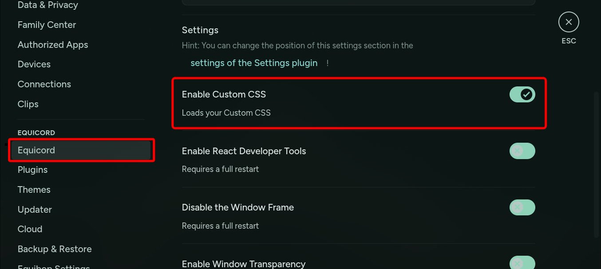

# Discord

Discord doesn't support theming by default. You need to modify the Discord client to
apply a material theme. This guide is for pre-modified clients like
[Goofcord](https://github.com/Milkshiift/GoofCord),
[Vesktop](https://github.com/Vencord/Vesktop),
[Equibop](https://github.com/Equicord/Equibop).

::: danger STOP
Using a modified client violates Discord’s
[Terms of Service](https://discord.com/terms) and may result in account suspension or
a permanent ban. Proceed at your own risk — I am not responsible for any actions
taken against your account. However, I yet to see anyone getting banned only for
theming.
:::

## Install

Install one of the pre-modified clients:

- [Goofcord](https://github.com/Milkshiift/GoofCord)
- [Vesktop](https://github.com/Vencord/Vesktop)
- [Equibop](https://github.com/Equicord/Equibop)

## Link

Add the following lines to the
[configuration](/configuration#linking-generated-files):

```toml{4-6}
[links]
# ...
"midnight-discord.css" = [
    "~/.config/equibop/settings/quickCss.css",
    "~/.config/vesktop/settings/quickCss.css",
    "~/.config/goofcord/GoofCord/assets/material.css"
]
```

> Thanks to [refact0r/midnight-discord](https://github.com/refact0r/midnight-discord)
> for creating the original theme, and
> [InioX/matugen-themes](https://github.com/InioX/matugen-themes) for creating the
> original template.

<!--@include: ./_regen.md-->

## Quick CSS

For **Vesktop** and **Equibop**, you need to enable `quickCss`. Go to `User Settings`
\> `VENCORD/QUICORD` and check `Enable Custom CSS`. The new theme will be
automatically applied. If it doesn't, restart Discord.



## Reload

All three of these clients support automatic live reloading without any action from the user.
